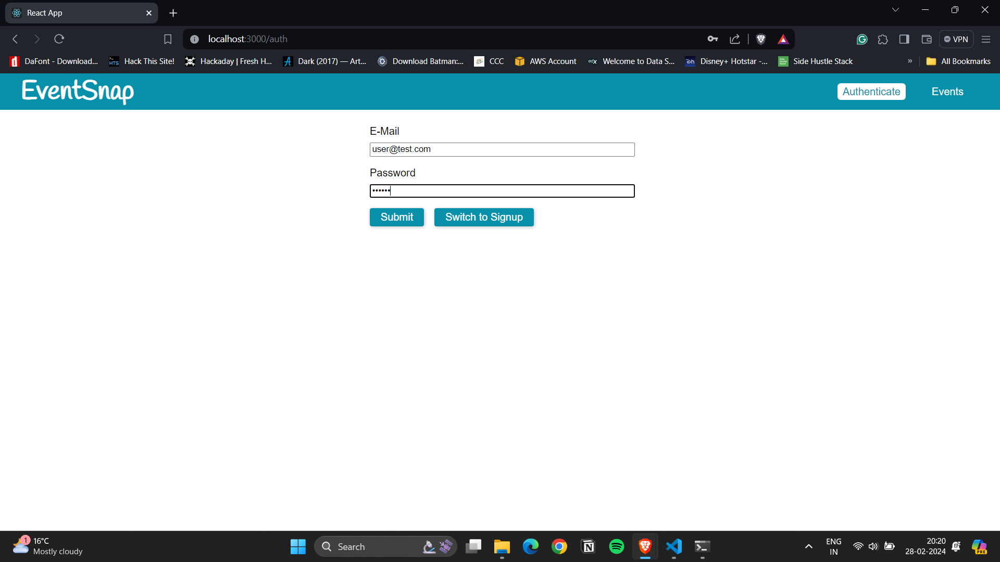
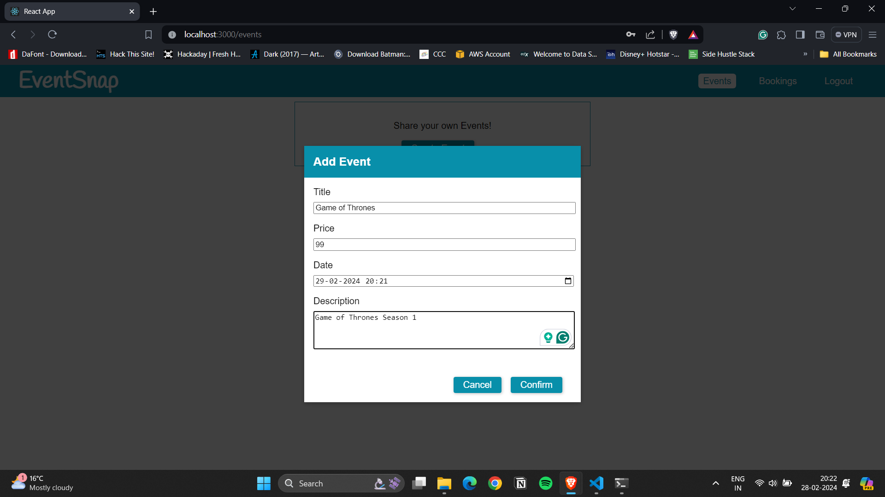
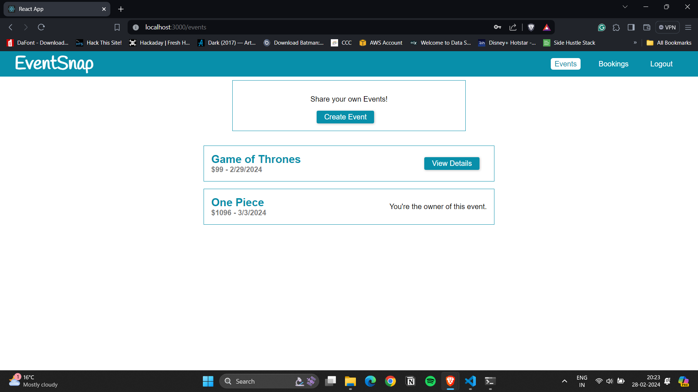
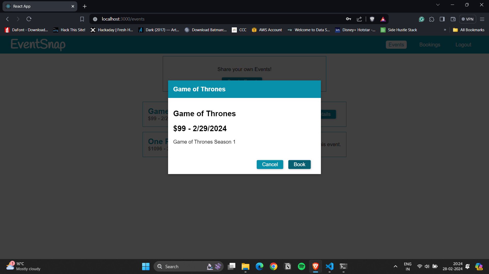
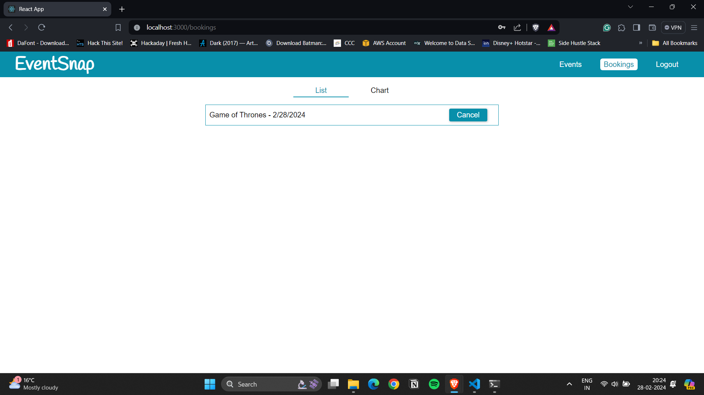
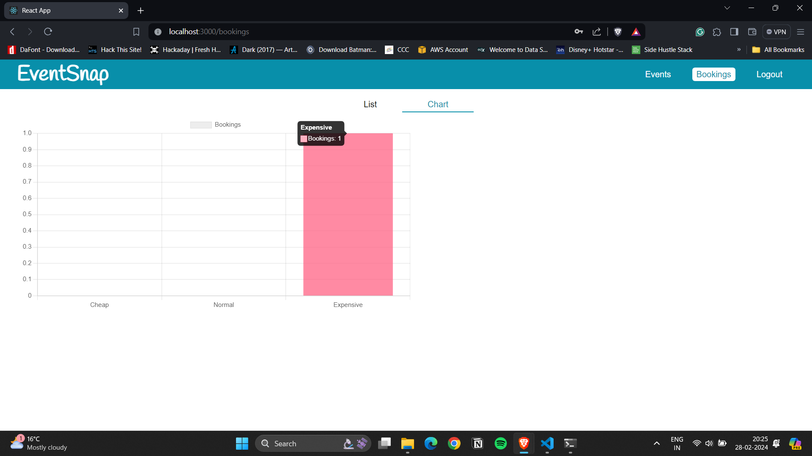

# EventSnap 📅✨

Welcome to EventSnap! 🎉 EventSnap is an event booking application designed using MERN stack and GraphQL to simplify the process of discovering and booking events. Whether you're hosting an event or looking for the next exciting gathering, EventSnap has got you covered. Get ready to dive into a world of events and create memorable experiences.

## Table of Contents
- [Description](#description)
- [Getting Started](#getting-started)
- [Preview](#preview)
- [Technologies Used](#technologies-used)
- [External Dependencies](#external-dependencies)
- [Features](#features)
- [Customization](#customization)
- [Contributing](#contributing)

## Description
EventSnap is a modern event booking app that simplifies the process of discovering and booking events. The backend is built with Node.js, Express, and GraphQL, while the frontend is developed with React. The application includes features such as event discovery, user authentication, and a GraphQL API for efficient data querying.

## Getting Started
To start your EventSnap adventure:

1. Clone the EventSnap repository.
   
   ```bash
   git clone https://github.com/your-username/EventSnap.git
   ```
2. Navigate to the project directory.

   ```bash
   cd EventSnap
   ```
3. Start the backend server.

   ```bash
   npm start
   ```
4. Navigate to the frontend directory.

   ```bash
   cd frontend
   ```
5. Start the frontend server.

   ```bash
   npm start
   ```
Access the application at http://localhost:3000 and explore the world of events!

## Preview
Login Page Preview:



Create Events: 



View Existing Events:



Book Events:



View Bookings List:



Bookings Chart:



## Technologies Used

MongoDB Atlas

Express

GraphQL

React

Node.js

## External Dependencies
DataLoader: Enhances data fetching efficiency for improved performance.

## Features
Event Discovery: Explore a variety of events suitable for different interests.

User Authentication: Create an account or log in to book events and manage your bookings.

GraphQL API: Utilizes GraphQL for efficient and flexible data querying.

Concurrent Execution: Use Concurrently to run both backend and frontend concurrently during development.

Visualization Components: Includes components like BookingsChart for visualizing booking data.

## Customization
Feel free to enhance the application by adding new features, improving the UI, or extending functionalities. The modular structure allows for easy customization and expansion.

## Contributing
If you'd like to contribute to the project, follow these steps:
1. Fork the repository.
2. Create a new branch for your feature or bug fix.
3. Make changes and submit a pull request.
